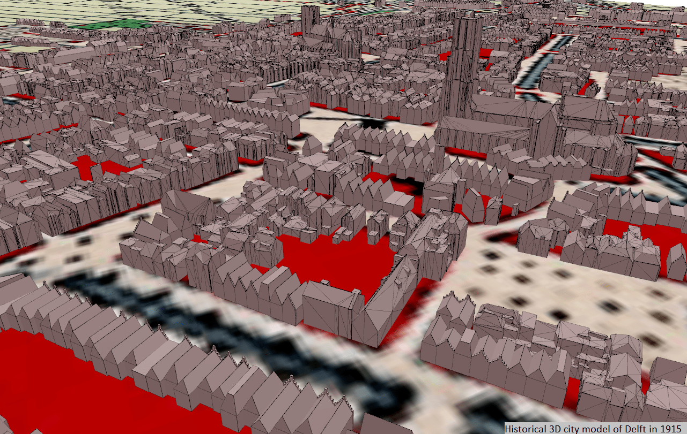

# Automatic reconstruction of 3D city models from historical maps 




This code allows to reconstruct automatically historical 3D city models from historical maps and it focusses on  arguably the  most  important  aspect  in  cities:  buildings. Given one historical map, it automatically reconstructs plausible building models, i.e.  as  we  are  limited  by the amount of historical information available, it is based on educated  guesses  and  assumptions  in  order  to  infer 3D models that most likely match reality at a given moment in time. 

The  methodology  we  propose  to automatically reconstruct the 3D city models of a city at different times  consists  of  four  main  steps:  (1)  the  preparation  of the  historical  maps,  (2)  the  processing  of  the  historical maps  to  extract  the  building  plots,  (3)  the  subdivision  of these building plots into individual building footprints using two  different  alternatives  and  (4)  the  reconstruction  of  3D buildings from these building footprints. Two implementations of the methodology exist, a complete and a shortened one. Running one or the other depends on the input datasets provided (see [Input data](#input-data)). More details about the methodology workflow are available in the corresponding [MSc thesis](http://resolver.tudelft.nl/uuid:0889e498-cdd6-4a19-bbcb-d3fb189560e1), or in [this paper](https://link.springer.com/article/10.1007/s44212-022-00011-3). 


## Input data

There are some required datasets for running the code: 
* **Historical map** georeferenced in a _projected_ coordinate reference system (TIF file)
* **Training dataset** made of training points (Shapefile). Each point is accompanied by its ID, the name of the class of features to which it belongs (string) and the label of the class (integer). Note that buildings belong to the `building` class, textual features belong to the `text` class and map symbols are part of the `symbol` class. 
* **Point cloud** of _ground_ points stored as a LAS file or as a Shapefile. 

If these datasets are provided alone, the shortened methodology version is implemented. Providing also the following optional datasets allows to implement the complete methodology version: 

* **Current building footprints dataset** stored in a Shapefile and accompanied by the following specific attributes: an identificatie number (named `identificatie`), the building year of construction (named `bouwjaar`) and percentile roof heights (e.g. named `roof-0.5` for the median height). If this dataset is provided along with 3D building models (see below), historic remaining buildings will be recovered from these data by a process called maps alignment (Step3) and not further modelled in 3D (_complete methodology version_). If these datasets are not provided, this step is skipped (_shortened methodology version_). 
* **3D building models** stored in a CityJSON file and accompanied by their `identificatie` number linking this dataset to the previously mentioned building footprints dataset. 
* **Ground truth dataset** made of points located inside the original building plots (one building plot <==> one point) (Shapefile). If this dataset is provided, metrics such as the precision and the recall are computed to assess the performance of the building plots extraction step (Step2)

Note that ALL these datasets must be georeferenced in the same _projected_ coordinate reference system. See the [MSc thesis](http://resolver.tudelft.nl/uuid:0889e498-cdd6-4a19-bbcb-d3fb189560e1) for more information about these data.

## How to get it ? 
To run this code, you need a recent version of the following open source tools: 

* Python 3.5+
* Blender 2.83.0+ and the following Blender addons: [BlenderGIS](https://github.com/domlysz/BlenderGIS), [Up3date](https://github.com/cityjson/Up3date) and BCGA. For the BCGA addon, please use the enriched version provided in this repository (folder `BCGA_addon`).
* GRASS GIS 7.8+ and the GRASS Python Scripting Library
* [cjio](https://github.com/cityjson/cjio)
* [val3dity](https://val3dity.readthedocs.io/en/latest/)

Note that this code was developped using Windows and was not tested with macOS. 

## Example data 

The folder `delft_1961` contains example data that can be used to test the code. It contains the data needed to run the code for a small subset of an [historical map of Delft in 1961](https://heritage.tudelft.nl/en/objects/kaartenkamer-gidskaartjes/?id=4). The resulting historical 3D city model can be found in `procedural_modelling\histo_model_delft_1961.json`. For more input or output data used with this code, see the [other GitHub repository](https://github.com/CamilleMorlighem/histo3d-data). 

## How to run it ? 
To run this code, use as example the example data in folder `delf_1961` and follow these steps: 
1. Create a folder and name it using the name of the city (`<city name>`) and the date of the historical map (`<map year>`), such as folder `delf_1961`
2. In this folder, create a subfolder called `input_data` which will contain all required (and optional) data to run the code. Note that in this subfolder the input datasets should have specific names: 
    * Historical map: `<city name>_<map year>` (e.g. `delft_1961`)
    * Training dataset: `training_points_<city name>_<map year>` (e.g. `training_points_delft_1961`)
    * Point cloud: `point_cloud_<city name>` (e.g. `point_cloud_delft`)
    * Current building footprints dataset: `building_footprints_<city name>` (e.g. `building_footprints_delft`)
    * 3D building models: `3D_buildings_<city name>` (e.g. `3D_buildings_delft`)
    * Ground truth dataset: `ground_truth_<city name>_<map year>` (e.g. `ground_truth_delft_1961`)

<br/>

3. Execute from the command line the python script `src_code\main_whole_workflow.py` as follows:  

```console
python <full path of main_whole_workflow.py> <city name>_<map year> EPSG:<epsg code of the 2D CRS in which the data are georeferenced> urn:ogc:def:crs:EPSG::<EPSG code of the corresponding 3D CRS for the output 3D city model> <path of the GRASS GIS batch file> <path of the Blender executable file> <path of the val3dity executable file>
```

For example to run it on Windows with the example data folder (`delft_1961`), first unzip `delft_1961\input_data\3D_buildings_delft.zip` and then execute : 

```console
python h3dcm\src_code\main_whole_workflow.py delft_1961 EPSG:28992 urn:ogc:def:crs:EPSG::7415 "C:\Program Files\GRASS GIS 7.8\grass78.bat" "C:\Program Files\Blender Foundation\Blender 2.83\blender.exe" C:\Program Files\val3dity-windows-x64-v2.2.0\val3dity.exe
```

4. After launching this command, the console will query you for the input user-defined parameters to be used in the reconstruction process: 

* Parameters of Step 2, i.e. building plots extraction: 
    * `alpha` : $\alpha$ value of the first generalisation method based on an $\alpha$-shape operator used to smooth the contour of the building plots extracted from the historical map. 
    * `distanceThreshold` : distance threshold used in the second generalisation method to smooth the contour of the building plots extracted from the historical map.
    * `angleThreshold` : angle threshold (in degrees) used in the second generalisation method to smooth the contour of the building plots extracted from the historical map.
* Parameters of Step 3, i.e. reconstruction of individual building footprints: 
    * `depthMin` : minimum building footprint depth allowed when reconstructing individual building footprints from building plots. 
    * `depthMax` : maximum building footprint depth allowed when reconstructing individual building footprints from building plots. 
    * `lengthMin` : minimum facade length allowed when reconstructing individual building footprints from building plots. 
    * `lengthMax` : maximum facade length allowed when reconstructing individual building footprints from building plots. 
    * `avgArea` : average building footprint area for the individual building footprints to be reconstructed. 
    * `minArea` : minimum building footprint area allowed for the individual building footprints to be reconstructed. 
* Parameters of Step 4, i.e. reconstruction of 3D buildings, used in the _shortened methodology version_: 
    * `minRoof` : minimum building height (i.e. not including the roof) allowed when reconstructing 3D buildings. 
    * `maxRoof` : maximum building height (i.e. not including the roof) allowed when reconstructing 3D buildings. 
    * `minMansard` : minimum mansard height allowed when reconstructing 3D buildings. 
    * `maxMansard` : maximum mansard height allowed when reconstructing 3D buildings. 

See the [MSc thesis](http://resolver.tudelft.nl/uuid:0889e498-cdd6-4a19-bbcb-d3fb189560e1) for more information about these parameters and guidance about the values to provide. 

5. After the script was executed, three additional subfolders are created in the main folder `<city name>_<map year>` (e.g. `delft_1961`): (1) `building_plots_extraction`, (2) `plots_to_fp` and (3) `procedural_modelling`, which respectively contain the results of Step 2, Step 3 and Step 4. Interesting outputs are: 

    * `building_plots_extraction\metrics_<city name>_<map year>.txt` : text file containing the precision, recall and F-score values after the building plots extraction step. 
    * `building_plots_extraction\metrics_<city name>_<map year>.csv` : csv file with a series of metrics (e.g. average area, average perimeter, average number of vertices and others) computed after the building plots extraction step. 
    * `building_plots_extraction\final_plots_<city name>_<map year>.shp` : Shapefile with the building plots extracted from the historical map, vectorised and generalised. 
    * `plots_to_fp\final_all_footprints.shp` : Shapefile with all the building footprints reconstructed from the building plots. 
    * `procedural_modelling\histo_model_<city name>_<map year>.json` : final historical 3D city model reconstructed with the whole methodology workflow, stored as a CityJSON file.  
    * `procedural_modelling\val3dity_report.json` : report from the val3dity validator. 
    * `procedural_modelling\cjio_report.txt` : report from the cjio validator. 

## Citation/credit
The present code makes use of the following open source codes: 

* The open source map vectoriser of [Arteaga (2013)](https://doi.org/10.1145/2534931.2534932);  
* The maps alignment method of [Sun et al. (2020)](https://doi.org/10.1080/13658816.2020.1845702); 
* The building footprints generalisation method of [Commandeur (2012)](http://resolver.tudelft.nl/uuid:c0c665f7-0254-42c6-895b-cb59acc079f2); 
* The [convex decomposition implementation](https://github.com/wsilva32/poly_decomp.py) of Silva (2016);  
* The turning function [MATLAB implementation](https://github.com/matan2050/TFMatcher) of Weissbuch (2017). 

When using this code in a scientific context, please cite the following paper:

Morlighem, C., Labetski, A. & Ledoux, H. Reconstructing historical 3D city models. Urban Info 1, 11 (2022). https://doi.org/10.1007/s44212-022-00011-3


